# 图书借阅管理系统

管理员用的网页后台：登录后管理分类、图书、读者，办理借书和还书。读者不能自己上网借书。

借出时剩余会减 1，还书后加 1。没有剩余，或读者已借满，就不能再借。应还日期为借出当天起 30 天。

---

## 1. 登录

输入账号和密码，正确后进入后台。

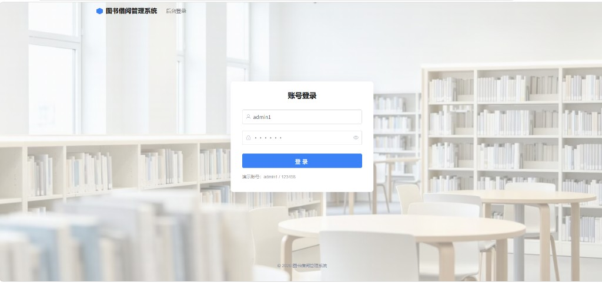

---

## 2. 图书分类

给图书分门别类，例如文学小说、少儿读物。登记新书时要选分类。

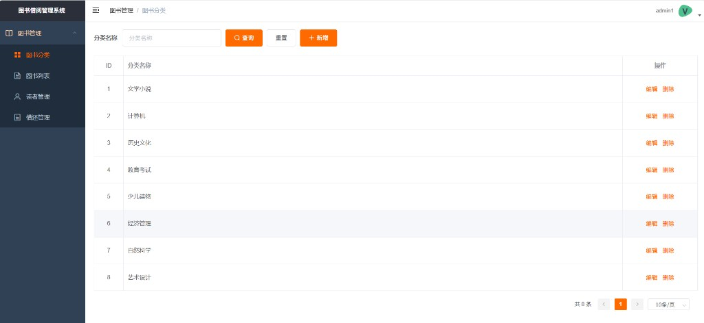

**查询**：输入名称关键字，点「查询」。不必打全称。

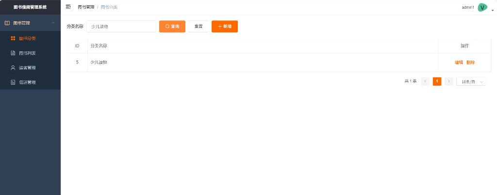

**新增**：点「新增」，填写名称后确定。

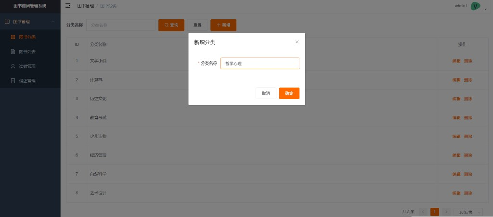

**修改**：点「编辑」，改名称后确定。

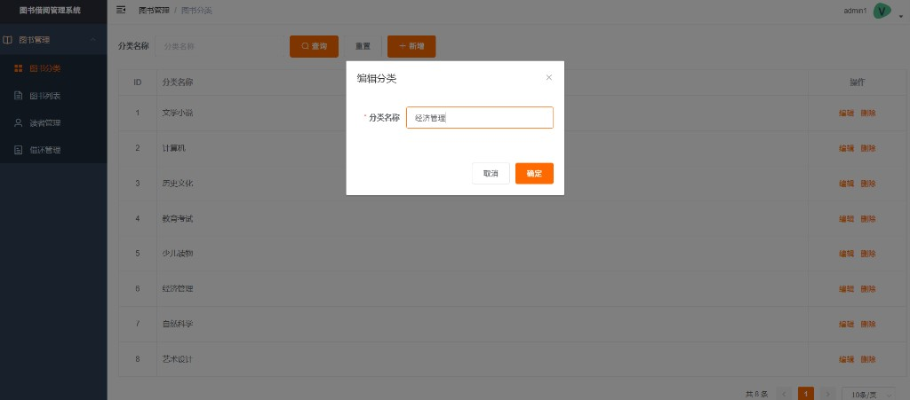

**删除**：点「删除」会再确认。该分类下已有图书时，不能删。

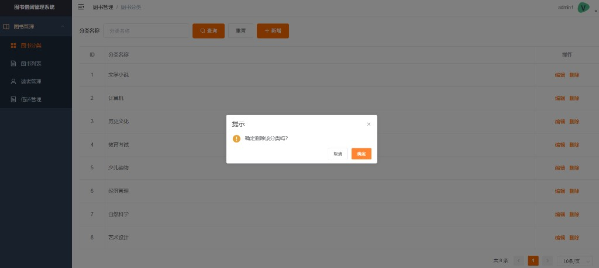

---

## 3. 图书列表

登记书名、作者、出版社、分类。

- **库存**：这种书一共有多少本
- **剩余**：现在还能借几本

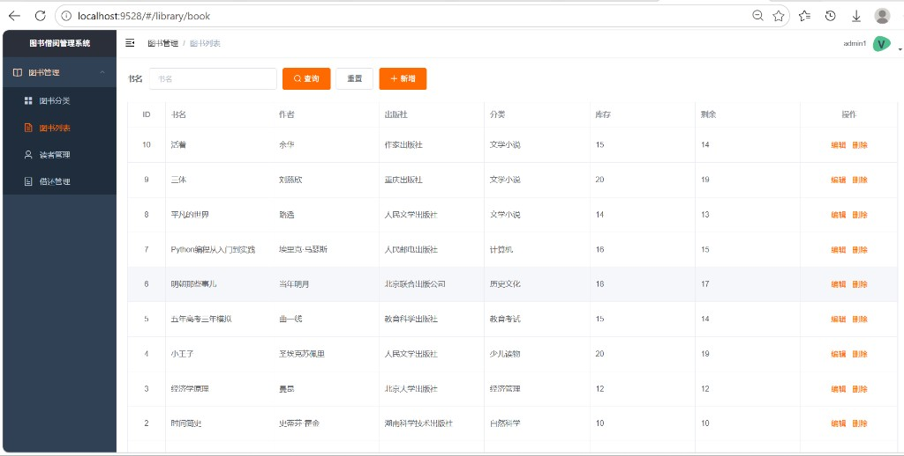

**查询**：按书名关键字查找。

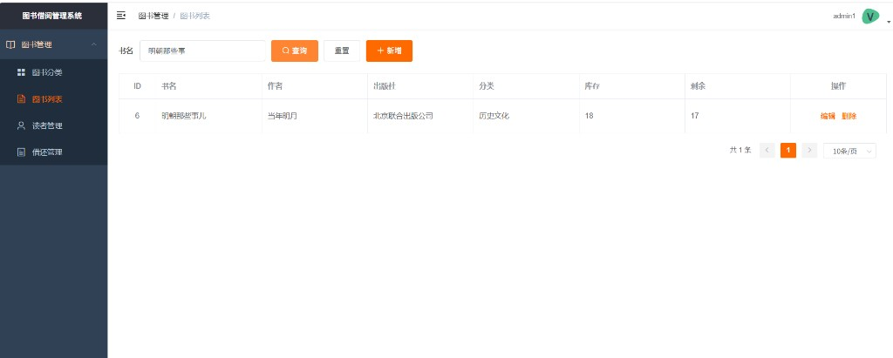

**新增**：填写书名、作者，选择分类，填库存和剩余。新书未借出时，剩余与库存相同。

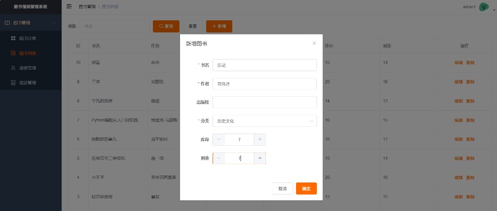

**修改**：点「编辑」，改图书信息。

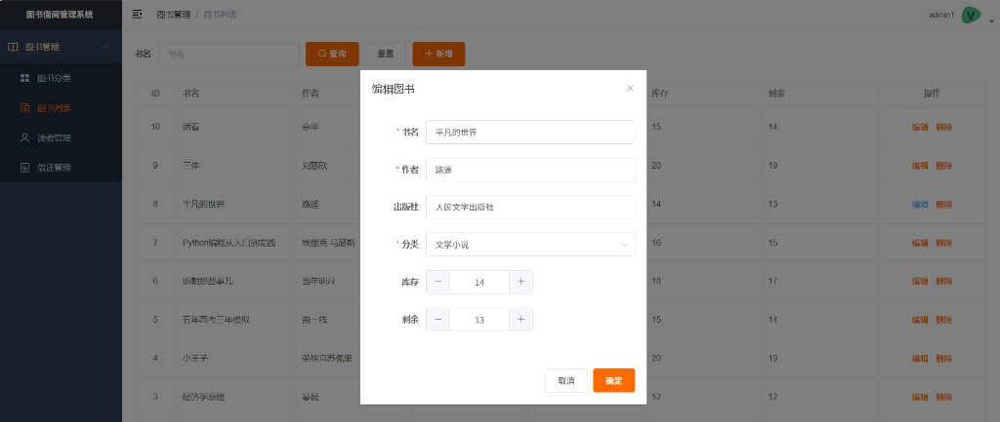

**删除**：会再确认。该书还有未还记录时，不能删。

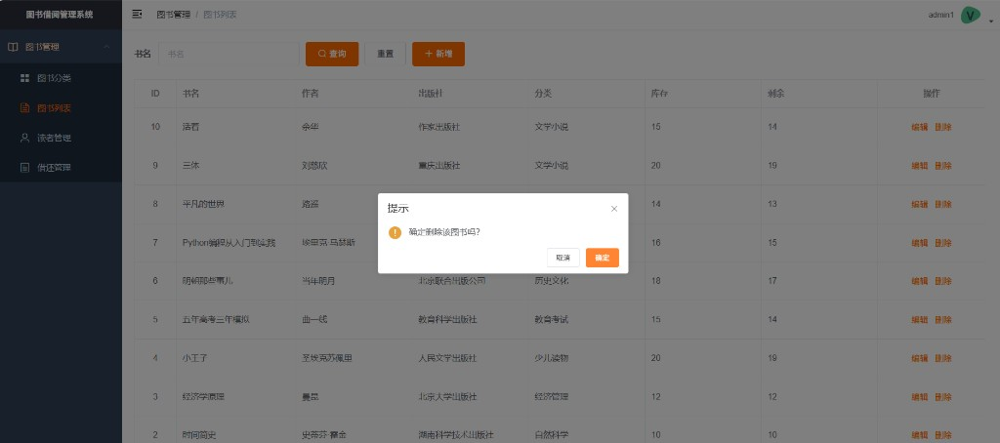

---

## 4. 读者管理

登记借书人的姓名、性别、电话，以及最多能同时借几本（可借数量）。不登记读者，无法借书。

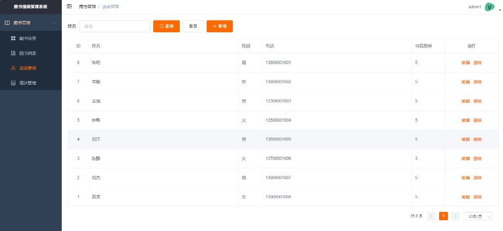

**查询**：按姓名查找。

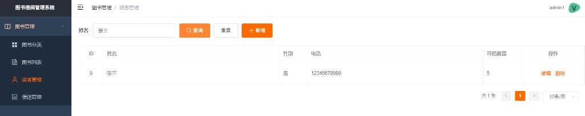

**新增**：填写姓名（必填），可选填电话，设置可借数量。

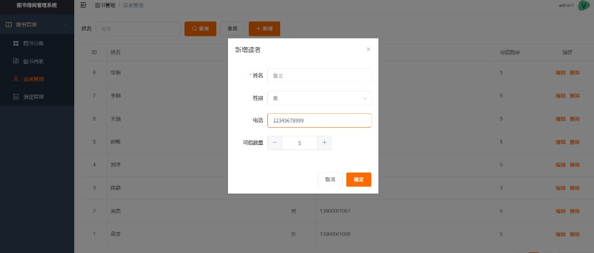

**修改**：点「编辑」，改读者资料。


**删除**：会再确认。该读者还有未还的书时，不能删。

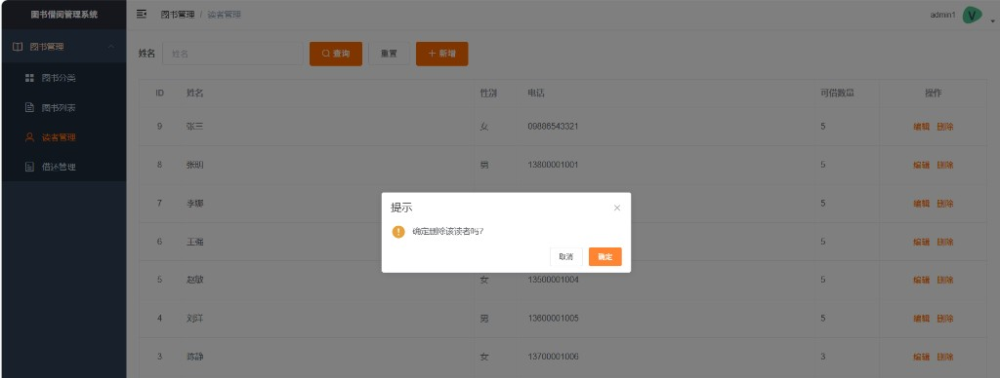

---

## 5. 借还管理

查看谁借了哪本书、何时应还、是否已还。

- **借出中**：未到期
- **已逾期**：到期仍未还
- **已还**：已归还

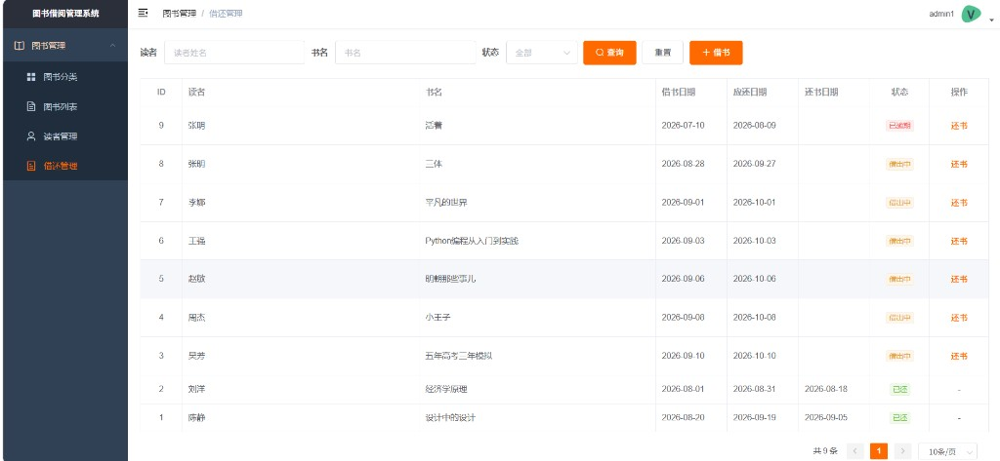

**借书**：选择读者和图书（会显示剩余）。确定后记一条记录，剩余减 1。

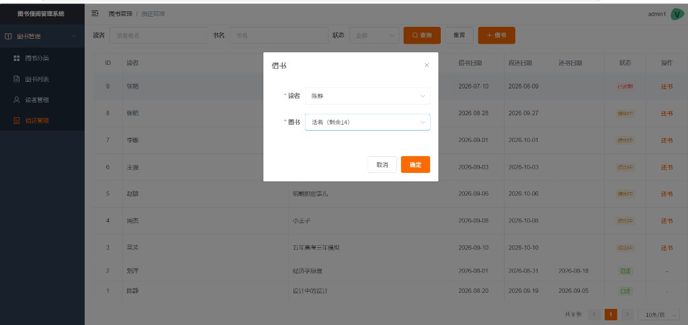

**查询**：可按读者、书名、状态筛选。

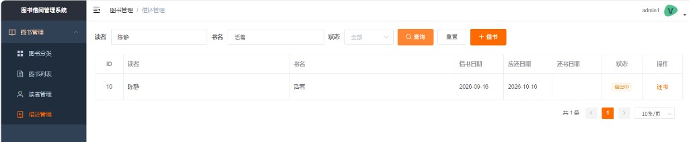

**还书**：点「还书」并确认。记下还书日期，剩余加 1。

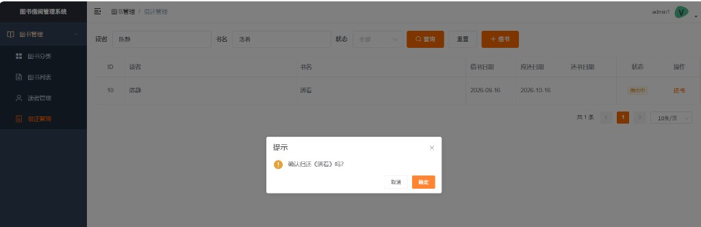

---

## 本机运行

- 前端：Vue2 + Element UI
- 后端：Django 4.2 + Django REST Framework
- 登录：JWT
- 数据库：MySQL

### 1. 环境准备

- Python 3
- Node.js
- MySQL（已启动）

### 2. 数据库

#### 2.1 建库

库名：`book_borrow_management_system`  
字符集：`utf8mb4`

#### 2.2 改配置

在 `backend/backend/settings.py`里改数据库账号和密码等

### 3. 启动后端

进入后端目录：

```bash
cd backend
```

第一次需要创建虚拟环境（已有 `backend/venv` 则跳过这一步）：

```bash
python -m venv venv
```

Windows PowerShell 激活虚拟环境：

```bash
.\venv\Scripts\Activate.ps1
```

提示符前面出现 `(venv)` 后再安装依赖、建表、创建管理员：

```bash
pip install -r requirements.txt
python manage.py makemigrations
python manage.py migrate
python manage.py createsuperuser
python manage.py runserver
```

`createsuperuser` 时按提示输入用户名和密码。本仓库演示账号名为 `admin1`

后端地址：`http://127.0.0.1:8000/`

接口前缀：`/api/`。不要只打开根地址，没有首页，出现 404 是正常的。

已经建过环境、装过依赖的，下次只要：

```bash
cd backend
.\venv\Scripts\Activate.ps1
python manage.py runserver
```

### 4. 启动前端

另开一个终端，进入前端目录：

```bash
cd frontend
npm install
npm run dev
```

已经装过依赖的，下次只要：

```bash
cd frontend
npm run dev
```

浏览器打开：`http://localhost:9528`

开发时代理：前端请求 `/dev-api`，转发到后端 `http://127.0.0.1:8000/api`。

登录后默认进入图书分类页。Access Token 有效期 2 小时，过期后重新登录即可，数据不会丢。

### 5. 目录说明

```text
图书借阅管理系统/
  backend/                 Django 项目
    apps/library/          分类、图书、读者、借还
    apps/users/            登录、当前用户信息
    backend/settings.py    数据库、JWT、跨域
  frontend/                Vue 后台
    src/views/library/     四个业务页面
    src/api/library.js     对应接口
    src/router/index.js    菜单路由
```

### 6. 主要接口

| 说明     | 方法 | 地址 |
| -------- | ---- | ---- |
| 登录     | POST | `/api/login/` |
| 当前用户 | GET  | `/api/user/info/` |
| 分类     | CRUD | `/api/book-categories/` |
| 图书     | CRUD | `/api/books/` |
| 读者     | CRUD | `/api/readers/` |
| 借还记录 | CRUD | `/api/borrows/` |
| 还书     | POST | `/api/borrows/{id}/return/` |

登录成功后，请求头带：`Authorization: Bearer <token>`。
